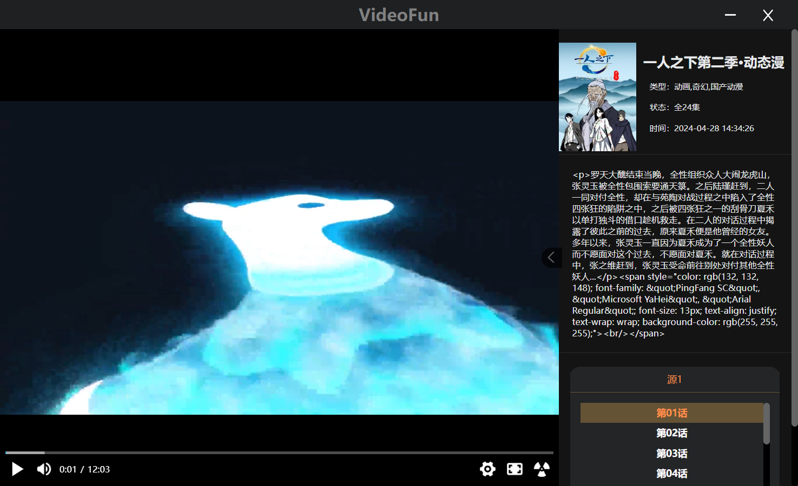

# VideoFun
> 本项目是一款集齐推荐、搜索、播放三大功能的视频软件， 并且是仅供个人学习的开源前端项目，项目仅供学习目的，如果觉得写得不够好可以clone下去而开

本前端项目使用的技术栈
- [Electron](https://www.electronjs.org/zh/) ([Electron-vite](https://cn.electron-vite.org/))
- [Vue3](https://cn.vuejs.org/)
- [Pinia](https://pinia.vuejs.org/zh/)
- [Vue-Router](https://router.vuejs.org/zh/)
- [NPlayer](https://nplayer.js.org/docs/) (主要播放器)
- Tools、Log

**tips:本项目无后端，是纯前端的electron项目**

## 运行及编译
安装依赖
```bash
npm i
```
运行
```bash
npm run dev
```
编译
```bash
npm run build && npm run build:win
```

## 项目展示





## 源编写说明
> 本项目编写时采用了影视资源采集网，作为后端接口，但采集网的接口仅用于测试，并不提供频繁搜索和获取资源，因此本项目开源后不提供自带的源，需要后续二次开发中根据资源采集网的采集规则，自行搭建后端接口采集接口

源文件编写：[normal.ts](https://github.com/Star-Vk/VideoFun-public/blob/main/src/main/bin/orgins/normal.ts#L5)

编写一个类，并且继承抽象类Orginal

### 设置资源链接 [orgins](https://github.com/Star-Vk/VideoFun-public/blob/main/src/main/bin/orgins/normal.ts#L7)
```typescript
orgins: { name: string; url: string; }[] = [];
```
orgins用于设置本源的链接有哪些，后续会根据相关方法请求这个数组里面的接口，例如：
```js
{
    wukong:"https://api.example.com/"
}
```

### 设置资源分类 [classList](https://github.com/Star-Vk/VideoFun-public/blob/main/src/main/bin/orgins/normal.ts#L9)
```typescript
classList: string[] = [];
```
用于设置分类列表，渲染进程中分类页就是根据这个来获取数据，例如：
```js
["爱情","动作","惊悚"]
```

### 编写获取推荐方法 [getRecommendation](https://github.com/Star-Vk/VideoFun-public/blob/main/src/main/bin/orgins/normal.ts#L16)
本方法用于首页推荐页，编写规则，可以批量请求orgins的链接，也可自行请求其他链接（此时：orgins数组无效），返回类型应当为:[videoType](https://github.com/Star-Vk/VideoFun-public/blob/main/src/main/bin/orgins/orgin.ts#L7)

videoType解析：
```typescript
export type videoType = {
    id:string, //资源id 唯一标识符
    name:string, //影视名称
    orgin:string, //源名称 应为orgins中的name 也可以为更新状态
    time:string, //更新事件（或者上映时间）
    picUrl:string, //图片url
    playUrl:{ //播放url的数组
        title: string; //剧集标题
        url: string; //播放url（应为可播放的资源url）
    }[][],
    type:string, //类型
    desc:string, //描述
}
```

### 编写搜索方法 [search](https://github.com/Star-Vk/VideoFun-public/blob/main/src/main/bin/orgins/normal.ts#L22)
主要为渲染进程搜索调用的方法
```typescript
//keyword为关键词
async search(keyword:string,orgins:Array<{name:string,url:string}> = this.orgins)
```
返回值与getRecommendation一致

### 获取分类数据 [getClassList](https://github.com/Star-Vk/VideoFun-public/blob/main/src/main/bin/orgins/normal.ts#L27)
主要为渲染进程分类页调用的方法
```typescript
async getClassList(listName:string,page:number,orgins:Array<{name:string,url:string}> = this.orgins):Promise<videoType[]>
```
返回值与getRecommendation一致

## 其他

历史文件没有使用sqlite有待完善，目前用的json保存